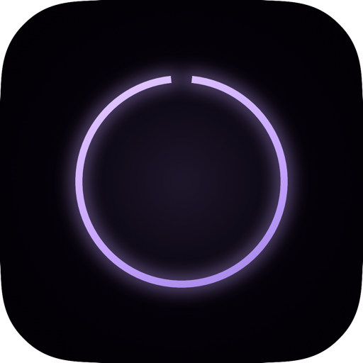

  

<h1 align="center">nox</h1>

  Your MacBook notch, actually useful. 
  Music · Voice · Files · Video · Calendar · Notes — all from one tiny spot.

  <a href="https://trynox.app">Website</a> ·
  <a href="https://github.com/left-society/nox/releases/latest">Download</a> ·
  <a href="https://github.com/left-society/nox/releases">Releases</a> ·
  <a href="https://github.com/left-society/nox/issues">Issues</a>

  
  
  
  

---

## What it does

Hover the notch and the panel blooms open. Move your cursor away and it folds back into the hardware notch like nothing was there.

A few of the things you can do from it:

- **Voice notes.** Hold Fn and talk. nox transcribes locally with Whisper, polishes with Groq if you give it a key, and pastes at your cursor in any app. Audio never leaves your Mac unless you opt into cloud cleanup.
- **Now playing.** Artwork and a clean transport row sit at the notch whenever music is playing — Spotify, Apple Music, YouTube, SoundCloud, anywhere. Tap the artwork to jump back to the source.
- **Drop anything.** Drag a file, image, or video over the notch and the panel splits into two zones — save into nox, or AirDrop straight out. Drop a YouTube link and it offers to download the video.
- **Live transcript.** Open the Script tab, paste a script, dial in your reading speed, hit Start. The notch pill morphs into a wide teleprompter right under the camera, so reading equals looking at the lens.
- **Focus & Study modes.** Persistent indicator at the notch, today + this week stats, pill suppression while you're locked in. Toggle from the Live tab or wire it to macOS Focus.
- **System glances.** Charging, screenshots, AirDrop, Bluetooth, calendar nudges two minutes out, timer countdowns — each one fades a small pill into the notch and clears itself when it's done.
- **Notes, images, videos, files.** The expanded panel has tabs for whatever you've collected. Notes use a real markdown editor with a clean popout. Images and videos thumbnail in a grid. Files stage as a drag-back-out clipboard.
- **Lock screen card.** A glass card with the current track sits on top while the screen is locked. Hardware media keys still work.

---

## Requirements

- macOS 14 Sonoma or later
- Apple Silicon Mac (M1 / M2 / M3 / M4)
- Works best on a notched MacBook Pro / Air — the silhouette welds to the camera notch. Non-notched Macs render a floating pill in the same spot.

---

## Install

1. [Download the latest DMG](https://github.com/left-society/nox/releases/latest)
2. Open it. Drag nox into Applications.
3. Launch nox. Onboarding walks you through the Accessibility, Microphone, and (optional) Calendar permissions — grant only the bits you actually need.

nox auto-updates via Sparkle. When a new version ships, it grabs the update in the background; you wake up on the latest version without lifting a finger.

---

## Privacy

- Voice transcription runs **locally** with WhisperKit by default. Audio leaves your Mac only if you explicitly turn on cloud cleanup (your own Groq API key, your own bill).
- Notes, images, videos, files, and screenshots are stored locally in `~/Library/Application Support/nox/`.
- No analytics. No telemetry. No account. No data ever phones home.

---

## Updates

[Latest release](https://github.com/left-society/nox/releases/latest) · [Full release history](https://github.com/left-society/nox/releases)

Sparkle handles in-app updates. Existing installs check the [appcast](https://trynox.app/appcast.xml) once a day and quietly install whatever's new.

---

## Issues & feedback

- **Bugs / feature requests:** [GitHub Issues](https://github.com/left-society/nox/issues)
- **Site:** [trynox.app](https://trynox.app)

If something's broken, the dictation log at `/tmp/nox-dictation.log` and the macOS Console (`log show --predicate 'process == "nox"' --last 5m`) usually have the smoking gun. Paste the relevant lines into the issue.

---

  Built in Swift + SwiftUI. macOS 14+. Apple Silicon. Free while we're testing.

